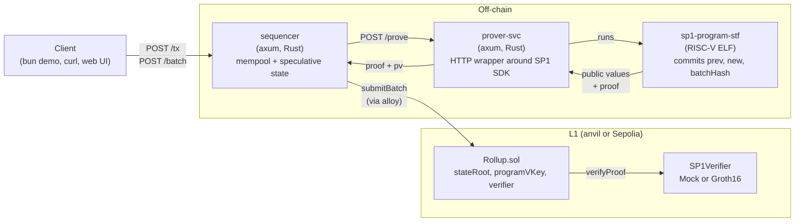
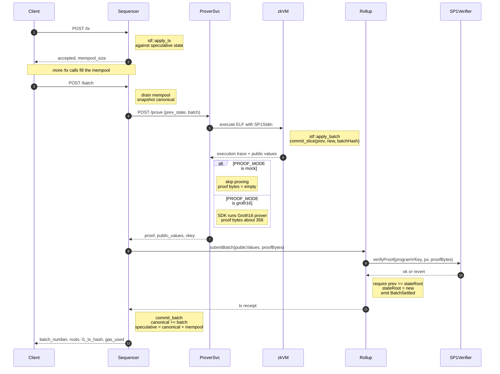
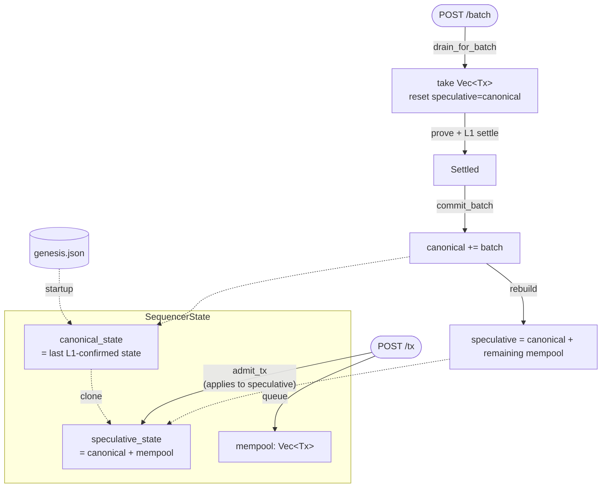

# zk-rollup

An end-to-end SP1-based zk-rollup. A minimal account-based ledger lives off-chain
in a Rust sequencer; signed transfers are batched and proved inside the SP1
zkVM; the proof is verified by an SP1 Solidity verifier on-chain, which advances
a state-root commitment in the `Rollup` contract.

The whole stack — anvil, prover, sequencer, deploy script, signed transfers,
batch settlement, optional web UI — runs from a **single command**:

```bash
bun run demo            # mock proofs + local anvil  (~5 seconds)
bun run demo:groth16    # real Groth16 proofs + local anvil  (~5 minutes)
bun run demo:sepolia    # real Groth16 proofs + Sepolia testnet
bun run web             # React UI on :3000 talking to a running demo
```

If you've never seen a working zk-rollup before, `bun run demo` is the
fastest way to watch one settle a batch on-chain.

---

## What's in the box

The demo proves a tiny but real claim: *given an off-chain state and a list
of signed transfers, the new state is the result of applying them honestly*.
Everything past that is plumbing — but it's the same plumbing a production
rollup needs, just simplified:

| Concern | This repo |
|---|---|
| L2 execution model | Account-balance ledger (no smart contracts on L2) |
| zkVM | [SP1](https://github.com/succinctlabs/sp1) v6.1.0 (RISC-V) |
| Proof system | Groth16 over BN254 (real) or SP1 mock |
| Settlement | `Rollup.sol` on anvil or Sepolia, calls SP1 verifier |
| Sequencer | Single in-memory sequencer (mempool + speculative state) |
| Data availability | Submitted as L1 calldata in `submitBatch(...)` |
| Bridges | None (genesis state is hard-coded in `genesis.json`) |
| Fraud-proof window | None — validity rollup with instant finality |

---

## Architecture



Three things to notice:

1. **The sequencer never proves anything itself.** It delegates to `prover-svc`
   over HTTP, so the prover process can be replaced with the Succinct prover
   network or a GPU prover without touching sequencer code.
2. **The zkVM program is the same Rust crate (`stf`) that the sequencer runs
   speculatively.** There's no separate "circuit" — the off-chain logic and
   the proved logic are one compile target.
3. **The on-chain contract is a thin advance-or-revert state machine.** It
   doesn't know what a batch is — it just verifies that the prover honoured
   the program vkey and accepts the new root.

---

## Transaction lifecycle



The whole flow is synchronous from the client's point of view — `POST /batch`
blocks until either L1 confirms or something fails. `prover-svc` runs each
SP1 call on a dedicated `std::thread` because the SP1 SDK's blocking client
opens its own Tokio runtime and panics if it sees an outer one.

---

## State machine inside the sequencer



**Why two layered states?** A user submitting two transfers in quick succession
expects the second to land at `nonce + 1`, even though the first hasn't been
proved or settled yet. `speculative_state` is the optimistic view that gives
that property; it collapses back to `canonical_state` whenever the canonical
view advances on L1 (or whenever a batch is in flight).

---

## Quick start

### 1. Prereqs

- [Bun](https://bun.com) 1.3+
- [Foundry](https://book.getfoundry.sh/) (forge, anvil, cast)
- [SP1 toolchain](https://docs.succinct.xyz/sp1/getting-started/install.html):
  ```bash
  curl -L https://sp1.succinct.xyz | bash && sp1up
  ```
- A reasonably recent Rust toolchain (cargo 1.85+)

### 2. Clone with submodules

`forge-std` and `sp1-contracts` (the vendored SP1 verifier suite) are
submodules:

```bash
git clone --recursive https://github.com/dadadave80/zk-rollup
# or, if you cloned without --recursive:
git submodule update --init --recursive
```

### 3. Install + build

```bash
bun install                # JS deps (viem, react)
bun run build:rust         # cargo build --release for the Rust crates
bun run build:contracts    # forge build for the Solidity side
```

The first Rust build takes ~5 minutes — it pulls in alloy, axum, the SP1
SDK, and gnark-recursion-ffi. Subsequent rebuilds are seconds.

### 4. Run a demo

```bash
bun run demo               # mock prover, ~5 seconds end-to-end
```

That orchestrator does **everything**: spawns anvil, prover-svc, sequencer;
deploys `Rollup.sol`; signs two transfers from a deterministic test wallet;
triggers a batch; prints L1 settlement details and final balances; and parks
so you can poke the running services. Press Ctrl-C to tear it all down.

---

## Demo modes

| Command | L1 | Proof type | Backend | Wall time | Gas |
|---|---|---|---|---|---|
| `bun run demo` | local anvil | mock | mock | ~5 s | ~57k |
| `bun run demo:groth16` | local anvil | Groth16 | CPU (default) / GPU / network | ~5 min | ~280k |
| `bun run demo:sepolia` | Sepolia testnet | Groth16 | CPU (default) / GPU / network | ~5 min + L1 confirms | ~280k |

Two env axes control proof generation:

- **`PROOF_MODE`** — *what kind of proof* the host asks SP1 for: `mock` or `groth16`.
- **`SP1_PROVER`** — *what backend* generates it: `mock`, `cpu`, `cuda`, `network`.

The orchestrator picks compatible defaults and refuses combinations that
silently produce empty bytes (e.g. `PROOF_MODE=groth16` with `SP1_PROVER=mock`
yields a degenerate Groth16-shaped proof of length 0 that on-chain verifiers
reject — surfaced as `execution reverted` with no data, easy to misdiagnose).

### Real Groth16 locally — first-run setup

The first local Groth16 run needs SP1's **trusted setup** (~6.2 GB tarball
into `~/.sp1/circuits/groth16/v6.1.0/`). It downloads automatically the first
time you call `/prove` in groth16 mode, but you can prefetch it (resumable):

```bash
mkdir -p ~/.sp1/circuits/groth16/v6.1.0
curl -C - --retry 999 --retry-delay 30 --retry-connrefused \
  -o ~/.sp1/circuits/groth16/v6.1.0/artifacts.tar.gz \
  https://sp1-circuits.s3-us-east-2.amazonaws.com/v6.1.0-groth16.tar.gz
(cd ~/.sp1/circuits/groth16/v6.1.0 && tar -xzf artifacts.tar.gz && rm artifacts.tar.gz)
```

If you have an SP1 prover-network key, you can skip the local download entirely:

```bash
SP1_PROVER=network NETWORK_PRIVATE_KEY=0x… bun run demo:groth16
```

### Sepolia

Set RPC + funded private key, then:

```bash
export SEPOLIA_RPC_URL=https://eth-sepolia.g.alchemy.com/v2/<key>
export DEPLOYER_PRIVATE_KEY=0x<funded-sepolia-key>
bun run demo:sepolia
```

The orchestrator skips anvil, deploys `SP1VerifierGroth16` v6.1.0 + `Rollup`
to Sepolia, runs the same flow, and prints the Etherscan link on completion.

You'll need ~0.05 ETH on the deployer:

- ~3M gas to deploy the SP1 verifier (one-time per Rollup, unless you reuse
  one via the `SP1_VERIFIER` env override)
- ~280k gas per `submitBatch`

If you've already deployed an SP1 verifier, set `SP1_VERIFIER` and skip the
3M-gas redeploy:

```bash
SP1_VERIFIER=0x16837F6F61bd3C20B0D65B298C6c1bD2b4c94385 bun run demo:sepolia
```

A previously verified Sepolia run:
[0xf7341dba…35003](https://sepolia.etherscan.io/tx/0xf7341dbaa0605034a125853d487af08bae14c03bb0554f20fb517584caa35003)
— gas 280,718.

---

## Web UI

```bash
bun run web                # http://localhost:3000 with HMR
```

A React app served by Bun.serve. It polls the running sequencer every 1.5 s
and renders:

- canonical state root, program vkey, deployed Rollup address, proof mode
- alice and bob's live balances + nonces
- mempool table (with a flash animation on new entries)
- a sign-in-browser transfer form (viem account.sign over the same keccak
  preimage the Rust verifier reconstructs)
- a **build batch + settle** button that POSTs `/batch` and surfaces the
  L1 tx hash + gas in a toast
- session-local history of settled batches

The sequencer ships with permissive CORS; it's local-only by construction so
no origin allowlist is meaningful here.

---

## Repo layout

```
zk-rollup/
├── index.ts                # Bun orchestrator (the headline demo path)
├── web.ts                  # Bun.serve entry for the UI
├── web/                    # index.html + app.tsx + styles.css
├── package.json            # bun scripts: demo / demo:groth16 / demo:sepolia / web / build:*
├── Cargo.toml              # Rust workspace
│
├── crates/
│   ├── shared-types/       # Address, Tx, Account, State, Batch, PublicValuesStruct
│   ├── stf/                # apply_tx + apply_batch (pure, no_std-friendly)
│   ├── sp1-program-stf/    # zkVM binary; commits (prevRoot, newRoot, batchHash)
│   ├── sp1-script/         # host: execute_only, prove(mode), vkey_bytes32
│   ├── prover-svc/         # axum HTTP service wrapping sp1-script
│   ├── sequencer/          # axum HTTP service: mempool, speculative state, L1 client
│   └── ...                 # batcher / circuits / circuit-verifier / node /
│                           # sp1-program-agg / sp1-program-circ / state — v2 stubs
│
└── contracts/              # Foundry project
    ├── src/Rollup.sol      # SP1 verifier integration + state root
    ├── test/Rollup.t.sol   # 9 tests against SP1MockVerifier
    ├── script/Deploy.s.sol # env-driven deploy (mock or groth16)
    └── lib/sp1-contracts   # vendored SP1 verifiers (submodule)
```

---

## Component walkthrough

In dependency order — each crate is pretty small, so the README sketches the
intent and the code fills in the rest.

### `shared-types`

Wire-format primitives shared between the zkVM program and every host-side
crate.

- `Address([u8; 20])`, `Tx`, `Account`, `State` (sorted `Vec<(Address, Account)>`)
- `Batch { txs: Vec<Tx> }`
- `PublicValuesStruct { prevRoot, newRoot, batchHash }` — defined via
  `alloy_sol_types::sol!` so the zkVM program can `abi_encode` it and
  `Rollup.sol` can `abi.decode` it as a `(bytes32, bytes32, bytes32)` tuple
  with no schema duplication
- `recover_address`: secp256k1 ECDSA recovery from `r||s||v` signatures, with
  Ethereum-style address derivation (keccak of the uncompressed pubkey, last
  20 bytes). Accepts both `v ∈ {0, 1}` (k256) and `v ∈ {27, 28}` (viem) so
  Rust signers and viem in-browser signers both round-trip cleanly.

### `stf`

The pure state transition function. Same crate runs in two contexts:

- inside the SP1 zkVM (the proved path)
- in the sequencer for speculative `/tx` validation

`apply_tx` recovers the signer, checks `nonce` and balance, debits-and-credits.
`apply_batch` applies a `Vec<Tx>` sequentially, computes `prev_root` and
`new_root` via the merkle helper on `State`, hashes the batch, and packages
the result as a `PublicValuesStruct`.

The merkle root is intentionally simple — `keccak(addr ‖ balance_be ‖ nonce_be)`
folded over the sorted account list. Real rollups use a sparse merkle tree
to allow O(log n) inclusion proofs of individual accounts; we don't expose
inclusion proofs to L1, so a flat hash is enough.

### `sp1-program-stf`

The zkVM binary. Reads `(State, Batch)` from `SP1Stdin` via bincode, calls
`stf::apply_batch`, commits the abi-encoded `PublicValuesStruct` via
`sp1_zkvm::io::commit_slice`. The crate is **excluded from the host workspace**
because `sp1-zkvm` only compiles for `riscv32im-succinct-zkvm-elf`; instead,
`sp1-build` is invoked from `sp1-script`'s `build.rs` and produces an ELF that
the host embeds via `include_elf!("sp1-program-stf")`.

### `sp1-script`

Host-side wrappers around `sp1-sdk`:

- `execute_only(state, batch)` — runs the program in the RISC-V emulator
  without proving. Fast (~1 s for a small batch). The sequencer doesn't use
  it directly, but it's exposed via `/execute` for sanity-checking.
- `prove(state, batch, mode)` — full proof. Branches on `ProofMode`:
  - `Mock` returns empty `proof_bytes` (paired with `SP1MockVerifier` on-chain,
    which requires `proofBytes.length == 0`)
  - `Groth16` calls `client.prove(&pk, stdin).groth16().run()` and returns
    `proof.bytes()` — 356 bytes that begin with the verifier's selector
- `vkey_bytes32()` — the program's verification key as a `bytes32` hex string.
  The deploy script burns this into `Rollup.sol`'s `programVKey` immutable
  so a rolling-key attack can't replace the pinned program.

### `prover-svc`

A thin axum HTTP wrapper around `sp1-script`. The non-trivial bits:

- **No outer Tokio runtime.** SP1's blocking SDK calls `block_on` internally;
  if it sees a parent runtime it panics. So `main()` is a regular `fn`,
  startup work runs synchronously, and only then do we hand control to a
  manually-built Tokio runtime that serves the HTTP routes.
- **Each `/prove` runs on a fresh `std::thread`.** `tokio::task::spawn_blocking`
  doesn't help — its pool is *part of* the Tokio runtime and SP1's runtime
  detection still fires. A real OS thread sidesteps it; a `oneshot` channel
  ferries the result back.

### `sequencer`

Owns the mempool and the two layered states. Driven by `routes.rs`:

- `GET /health`, `GET /info`, `GET /root`, `GET /state/:addr`, `GET /mempool`
- `POST /tx { from, to, amount, nonce, signature }` — validates and admits
- `POST /batch` — drains mempool → calls `prover-svc /prove` → calls
  `Rollup.submitBatch` via alloy → updates canonical state on success or
  restores the mempool on failure

`l1.rs` defines the Rollup contract via alloy's `sol!` macro and pins
`gas_limit = 800_000` (~3× the empirical 280k) so the SDK doesn't even attempt
`eth_estimateGas`; estimateGas can be flaky on Sepolia for our payload.

### `index.ts` (orchestrator)

A single Bun script that:

1. Preflights binaries + ports
2. Spawns anvil (skipped on Sepolia)
3. Writes `genesis.json`
4. Computes the genesis merkle root via the `compute-root` Rust binary
5. Spawns prover-svc, vetos `SP1_PROVER=mock` if `PROOF_MODE` is real
6. Fetches the program vkey from prover-svc `/info`
7. Runs `forge script Deploy.s.sol` and parses the deployed Rollup address
8. Spawns the sequencer pointed at the new Rollup
9. Signs two transfers in-browser (via viem), submits, triggers `/batch`,
   prints the L1 settlement and final balances

Bun's `fetch` has an internal idle timeout that triggers during the long
Groth16 prove call; the orchestrator shells out to `curl -m 7200` for the
`/batch` POST to bypass that.

---

## HTTP API reference

### Sequencer (default `:7001`)

| Method | Path | Body | Returns |
|---|---|---|---|
| `GET` | `/health` | — | `"ok"` |
| `GET` | `/info` | — | `{ canonical_root, batch_count, mempool_size, program_vkey, proof_mode, rollup_address }` |
| `GET` | `/root` | — | `{ root }` |
| `GET` | `/state/:addr` | — | `{ address, balance, nonce }` |
| `GET` | `/mempool` | — | `[{ from, to, amount, nonce }, ...]` |
| `POST` | `/tx` | `{ from, to, amount, nonce, signature }` | `{ accepted, mempool_size, speculative_root }` |
| `POST` | `/batch` | `{}` | `{ batch_number, txs, prev_root, new_root, batch_hash, l1_tx_hash, l1_block, gas_used }` |

Addresses and signatures are 0x-prefixed hex strings; the server parses them
into byte arrays internally so the JSON shape stays human-friendly.

### Prover-svc (default `:7002`)

| Method | Path | Body | Returns |
|---|---|---|---|
| `GET` | `/health` | — | `"ok"` |
| `GET` | `/info` | — | `{ mode, vkey }` |
| `GET` | `/vkey` | — | `{ vkey }` |
| `POST` | `/execute` | `{ prev_state, batch }` | `{ public_values, prev_root, new_root, batch_hash, cycles }` |
| `POST` | `/prove` | `{ prev_state, batch }` | `{ proof, public_values, vkey, prev_root, new_root, batch_hash }` |

Prover-svc takes `prev_state` and `batch` as JSON-serialized Rust types from
`shared-types`; the easiest way to call it is from another Rust client (the
sequencer is the canonical example) or via the `smoke` binary in `prover-svc`.

---

## Manual run-through

If you want to drive each component by hand instead of the orchestrator:

```bash
# Terminal 1 — L1
anvil --port 8545

# Terminal 2 — prover-svc (it computes the program vkey at startup)
PROOF_MODE=mock SP1_PROVER=mock cargo run --release -p prover-svc

# Terminal 3 — query the vkey
curl -s http://localhost:7002/vkey

# Terminal 3 — write a genesis JSON, then compute its root
cat > genesis.json <<'EOF'
{
  "accounts": [
    { "address": "0x1a642f0E3c3aF545E7AcBD38b07251B3990914F1", "balance": 1000000, "nonce": 0 },
    { "address": "0x5050A4F4b3f9338C3472dcC01A87C76A144b3c9c", "balance": 0, "nonce": 0 }
  ]
}
EOF
cargo run --release -p sequencer --bin compute-root -- ./genesis.json

# Terminal 3 — deploy
cd contracts && \
  PROGRAM_VKEY=0x… GENESIS_ROOT=0x… PROOF_MODE=mock \
  forge script script/Deploy.s.sol \
    --rpc-url http://localhost:8545 \
    --private-key 0xac0974bec39a17e36ba4a6b4d238ff944bacb478cbed5efcae784d7bf4f2ff80 \
    --broadcast

# Terminal 4 — sequencer
DEPLOYER_PRIVATE_KEY=0xac0974bec39a17e36ba4a6b4d238ff944bacb478cbed5efcae784d7bf4f2ff80 \
ROLLUP_ADDRESS=0x… \
L1_RPC_URL=http://localhost:8545 \
PROVER_SVC_URL=http://localhost:7002 \
GENESIS_PATH=./genesis.json \
cargo run --release -p sequencer

# Terminal 3 — submit, batch, settle
cargo run --release -p sequencer --bin demo
```

---

## Configuration

The orchestrator reads `.env` automatically (Bun loads it without `dotenv`).
See `.env.example` for the full list. The variables that actually matter:

| Var | Used by | When |
|---|---|---|
| `PROOF_MODE` | sp1-script, prover-svc | `mock` or `groth16` (orchestrator overrides per script) |
| `SP1_PROVER` | sp1-sdk | `mock`, `cpu`, `cuda`, `network` (orchestrator vetoes `mock` if proof mode is real) |
| `NETWORK_PRIVATE_KEY` | sp1-sdk | only when `SP1_PROVER=network` |
| `SEPOLIA_RPC_URL` | orchestrator | required by `demo:sepolia` |
| `DEPLOYER_PRIVATE_KEY` | orchestrator + sequencer | required by `demo:sepolia` |
| `SP1_VERIFIER` | Deploy.s.sol | optional address override (skip verifier deploy) |
| `ROLLUP_ADDRESS` | sequencer | filled in by the orchestrator after deploy |
| `PROGRAM_VKEY` | Deploy.s.sol | filled in by the orchestrator from `/vkey` |
| `GENESIS_ROOT` | Deploy.s.sol | filled in by the orchestrator from `compute-root` |
| `GENESIS_PATH` | sequencer | path to `genesis.json` (default `./genesis.json`) |

---

## Testing

```bash
cargo test                                       # stf (5) + shared-types (3) — 8/8
cd contracts && forge test                       # Rollup (9) — against SP1MockVerifier
cargo run --release -p prover-svc --bin smoke    # POSTs a signed batch to a running prover-svc
```

The Forge tests use `SP1MockVerifier` from the vendored `sp1-contracts` so
they're hermetic; no network or trusted setup needed.

---

## What's intentionally out of scope

These crates are deliberately left as `cargo new --lib` stubs — they're
scaffolding for v2 work and aren't on the demo path:

| Crate | Intended for |
|---|---|
| `sp1-program-agg` | Multi-batch proof aggregation (one Groth16 over many STF proofs) |
| `sp1-program-circ` | Reserved for an alternative circuit family |
| `circuits` / `circuit-verifier` | Redundant with the on-chain SP1 verifier; placeholders for a custom verifier |
| `batcher` | Folded into the sequencer — would split out for multi-sequencer setups |
| `node` | Passive sync from L1 events; the sequencer is the source of truth in the demo |

Things that are missing for production but obvious to add:

- Bridges (deposits / withdrawals between L1 and L2 accounts)
- A real sparse merkle tree with on-L1 inclusion proofs
- Decentralised sequencing or at least a force-include path
- Proof aggregation (one L1 verify cost amortised over many batches)
- Replay protection beyond sequential nonces (e.g. domain separators per chain)

---

## Notes on the trust model

In `mock` mode you trust:

- That the orchestrator gave a real vkey (it did — generated by the same
  Rust binary that the sequencer uses)
- That `SP1MockVerifier` is the canonical no-op verifier (it is — vendored)

In `groth16` mode you additionally trust:

- The SP1 v6.1.0 trusted setup (everyone who relies on the SP1 gateway
  inherits this trust assumption)
- gnark-crypto's BN254 implementation

You do *not* trust the sequencer with funds. The Rollup contract validates
each `submitBatch` against the immutable `programVKey` and reverts on stale
prev roots, so the worst the sequencer can do is censor or stall.

---

## Etymology

`stf` is the *state transition function*. `sp1-script` is named after SP1's
host-script convention. `sequencer` is the L2 sequencer in the textbook
sense — orders user transactions, builds batches, posts to L1.

There's no aspiration here to compete with op-stack / zk-stack; the goal was
to write something small and complete enough that you can read it in an
afternoon.
